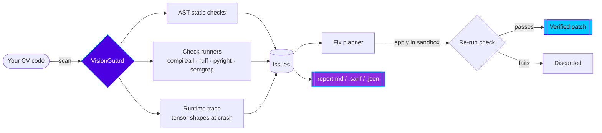

<!-- ════════════════════════════════════════════════════════════════ -->
<!--                        V I S I O N G U A R D                      -->
<!-- ════════════════════════════════════════════════════════════════ -->

<div align="center">

<a href="https://github.com/Rohit11-OG/VisionGuard">
  
</a>

<br/>


<br/><br/>

<!-- ░░░ BADGES ░░░ -->


<br/>


</div>

<!-- ░░░ NEON DIVIDER ░░░ -->


```text
        ╔═══════════════════════════════════════════════════════════╗
        ║   ░▒▓  S C A N  →  D E T E C T  →  F I X  →  R E P O R T  ▓▒░ ║
        ╚═══════════════════════════════════════════════════════════╝
              \                                             /
               \         ┌───────────────────────┐         /
                ●────────┤   visionguard scan     ├────────●
                         └───────────┬───────────┘
                          ▼          ▼          ▼
                    [AST checks]  [runtime]  [lint/type]
                          \          |          /
                           ●─────────●─────────●
                                     ▼
                            ╔════════════════╗
                            ║   report.md    ║
                            ╚════════════════╝
```

<div align="center">

### ⚡ The pipeline

</div>




## 🚀 Install

<table>
<tr>
<td width="50%">

**Windows · PowerShell**
```powershell
irm https://raw.githubusercontent.com/Rohit11-OG/VisionGuard/main/install.ps1 | iex
```

</td>
<td width="50%">

**Linux / macOS**
```bash
curl -sSL https://raw.githubusercontent.com/Rohit11-OG/VisionGuard/main/install.sh | bash
```

</td>
</tr>
</table>

**Or with pip:**
```bash
pip install "git+https://github.com/Rohit11-OG/VisionGuard.git[full]"
```

> `[full]` adds optional extras — `watchfiles`, `ruff`, `libcst`, `opentelemetry`.
> Drop it for a minimal install: **core scanning runs on the stdlib alone.**


## 🎮 Usage

```bash
visionguard bootstrap          # one-time setup — agent.yml + VS Code tasks
visionguard scan               # scan now
visionguard watch              # auto-scan on every file save
visionguard report --latest 5  # list recent reports
```

Each scan writes a single rolling **`.agent/reports/report.md`** (set
`reporting.rolling: false` for a numbered history).

<details>
<summary><b>🎯 Scoped scans — faster, less noise</b></summary>

```bash
visionguard scan --since main      # only .py files changed vs a git ref
visionguard scan --since HEAD~1
visionguard scan --staged          # only git-staged files
```

</details>

<details>
<summary><b>📊 Baseline — show only NEW bugs</b></summary>

```bash
visionguard scan --update-baseline # accept current issues
visionguard scan --new-only        # report only what's new
```

Report headers show **new** vs **known** counts. Issue identity is
line-number-independent — a known bug stays matched as code shifts.

</details>

<details>
<summary><b>💥 Runtime crash capture — with tensor shapes</b></summary>

```bash
visionguard run train.py --epochs 10
```

On an uncaught crash, records the traceback **plus the shape, dtype and
device of every array/tensor** live in the failing frames.

</details>

<details>
<summary><b>🛡️ CI gate & pre-commit hook</b></summary>

```bash
visionguard scan --fail-on high    # exit non-zero — drop into CI
visionguard scan --format sarif    # GitHub code-scanning
visionguard scan --format json
visionguard hook                   # install git pre-commit hook
visionguard hook --remove
```

The hook runs `scan --staged --new-only --fail-on high` on every commit.
Override with `git commit --no-verify`.

</details>


## 🔍 What It Detects

<div align="center">

### 🧠 CV Static Analysis — pure AST, no test run needed

</div>

| 🐞 Bug | 💀 Crash it prevents |
|---|---|
| `cv2.imread` without `None` check | Returns `None` on bad path → next line crashes |
| `.numpy()` without `.detach()/.cpu()` | Fails on a GPU or grad tensor |
| `plt.imshow` on a BGR image | Colors inverted — cv2 is BGR, plt is RGB |
| `cv2.resize` dsize order | `.shape[:2]` is `(H,W)` but dsize needs `(W,H)` |
| `wait_for_frames()` without `timeout_ms` | Hangs forever on camera disconnect |
| RealSense frame without `.is_valid()` | `get_data()` on an invalid frame crashes |
| `results.masks.xy` without None check | YOLO returns `None` when nothing detected |
| Division by a depth variable | RealSense returns `0` for invalid pixels |
| `queue.get(timeout=…)` without `Empty` handler | Silent thread crash on timeout |
| `self._frame` outside `with self._lock:` | Race condition in camera threads |
| `cv2.VideoCapture` without `isOpened()` | Silent fail on a wrong camera index |
| `cv2.VideoCapture` never released | Camera/file handle leaks — later opens fail |
| RealSense pipeline started, never stopped | Device stays locked — re-run can't acquire it |
| `torch.load()` without `map_location` | Crashes loading CUDA weights on a CPU-only box |
| `.to("cuda")` / `.cuda()` hardcoded | Crashes on machines without a GPU |
| Discarded tensor transform (`.to`/`.cuda`/`.cpu`/`.half`/`.detach`) | Not in-place — result silently lost |
| `threading.Thread` without `daemon=True` | Blocks clean program exit |
| `cv2.imwrite()` return discarded | Silent write failure on bad path / full disk |

<div align="center">

### ⚙️ Runtime Error Parsing &nbsp;·&nbsp; 🧵 Full Call-Chain Tracebacks

</div>

`SyntaxError` · `NameError` · `AttributeError` · `TypeError` · `ImportError` ·
`ValueError` · `IndexError` · `KeyError` · `ZeroDivisionError` ·
`FileNotFoundError` · `RecursionError` · `MemoryError` · tensor
shape/broadcast mismatches · CUDA OOM / device / dtype errors ·
`cv2.error` · PIL errors · RealSense timeout & pipeline errors ·
YOLO/ultralytics errors · cross-thread CUDA & event-loop errors.

> Every user-code frame is captured — `site-packages`, `venv` and stdlib
> frames are skipped automatically, so a tool's own crash is never
> mistaken for your bug.


## 📰 Report Format

```text
 ╔══════════════════════════════════════════════════════╗
 ║              V I S I O N G U A R D   R E P O R T      ║
 ╚══════════════════════════════════════════════════════╝
  Checks: compileall PASS | ruff PASS | basedpyright FAIL
  Total bugs: 6   New: 2   Known: 4   Patches ready: 1

  ▸ Bug #1 — [HIGH] RealSense frame used without is_valid()
      realsense_camera.py:47
      >>> 47 | color_frame = frames.get_color_frame()
          48 | data = color_frame.get_data()   # crashes if invalid

  ▸ Patch #1 — add timeout_ms=5000 to wait_for_frames()  [Verified ✓]
      -    pipeline.wait_for_frames()
      +    pipeline.wait_for_frames(timeout_ms=5000)
```

Patches are **sandbox-verified** — applied to a temp copy, the relevant
check re-run, and kept only if it passes. Nothing is silently changed.


## 🧰 Checks Run

| Tool | Purpose | Required |
|---|---|---|
| `compileall` | Syntax validation | Always |
| `pytest` | Test failures, runtime errors | If tests exist |
| `unittest` | Test discovery | If tests exist |
| `ruff` | Lint, unused vars, style | Optional |
| `basedpyright` | Static type checking | Optional |
| `semgrep` | Pattern-based security/bug rules | Optional |

Checks run **in parallel** and results are **cached on a project
fingerprint** — a rescan with no source change is near-instant.


## ⚙️ Config — `agent.yml`

Auto-created on first run.

```jsonc
{
  "mode": "safe_pr",
  "watch":     { "ignore": ["datasets", "checkpoints", "weights", "runs"] },
  "checks":    { "cache_results": true, "verify_fixes": true },
  "reporting": { "rolling": true },
  "auto_apply":{ "enabled": false, "min_confidence": 0.85 }
}
```


## 🧹 Remove

```bash
visionguard clean              # delete .agent/, agent.yml, VS Code tasks
visionguard clean --yes        # skip the prompt
pip uninstall visionguard -y   # remove the CLI
```

Your source code is **never** touched.


## 🎯 Target Stack

<div align="center">

`ultralytics` · `pyrealsense2` · `torch` · `torchvision` · `cv2` ·
`numpy` · `PIL` · `PyQt5` · `albumentations` · `scipy` · `threading` · `queue`

</div>

<br/>

<div align="center">


<sub>⭐ Star it if VisionGuard caught a bug for you · MIT Licensed</sub>

</div>
